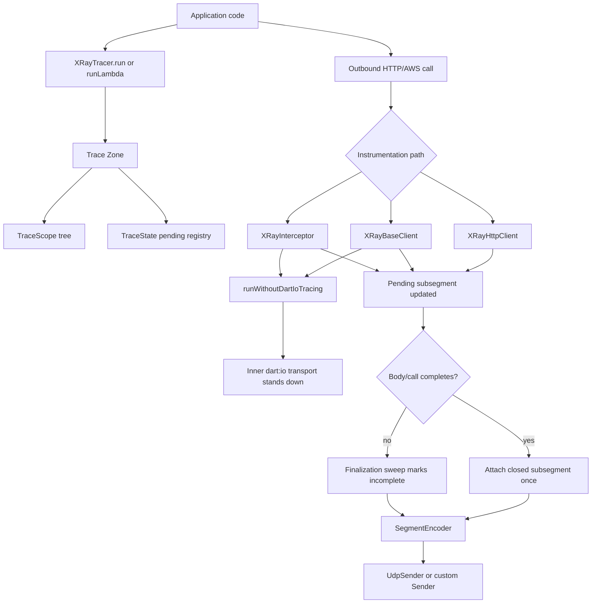

# Architecture Overview

## Purpose

The `aws_xray_sdk_dart` package provides distributed tracing support for Dart applications using AWS X-Ray semantics. It offers:

- automatic tracing of outbound `dart:io` HTTP requests,
- Package HTTP (`package:http`) tracing,
- adapter-based instrumentation for Smithy AWS SDK clients,
- Lambda `provided:al2023` subsegment support,
- pluggable sampling and UDP delivery to the X-Ray daemon.

For exact runtime contracts and edge-case behavior, see
[`tracing-behavior.md`](tracing-behavior.md).

## Core components

### Public API

- `XRayTracer`
  - central trace context for one service instance.
  - manages active segment/subsegment state via Dart `Zone`.
  - exposes `run`, `runLambda`, `beginSegment`, `closeSegment`, `beginSubsegment`, `endSubsegment`, and `failSubsegment`.
  - `captureAsync(name, fn)` runs a block as a **nested** subsegment, and `annotate` / `addMetadata` mutate the entity currently being traced.
  - `currentSegment` / `currentTraceId` read the active trace context inside a `run` / `runLambda` zone (both `null` outside one); `recordSegmentHttp` attaches HTTP request/response data to the root segment.

- `TraceContext`
  - the live handle passed to a `captureAsync` block: `annotate`, `addMetadata`, `setError`, `setFault`.
  - the only public surface of the runtime entity tree (the mutable `TraceScope` is internal).

- `XRay`
  - facade for integration helpers.
  - `patchHttp(tracer)` and `unpatchHttp()` for global `dart:io` HTTP patching.
  - `untracedHttpClient()` to build an unwrapped transport when tracing should be avoided.
  - `registerClient` / `fromClient` for Smithy AWS SDK client wrapping.

### Models

- `TraceId`, `Segment`, `Subsegment` represent X-Ray trace documents.
- `HttpData`, `AwsData`, `Cause` model X-Ray metadata blocks.
- Both `Segment` and `Subsegment` carry an optional `http` block (`HttpData`); on the root segment it is populated by the server middleware.
- `Segment` serialization supports split UDP payloads for large traces.

### Transport

- `Sender` is the transport abstraction.
- `UdpSender` is the default transport
  - sends segments and subsegment documents over UDP to the X-Ray daemon.
  - resolves host name and binds sockets for IPv4/IPv6 as needed.
- `segment_encoder.dart`
  - encodes a segment into one or more JSON payloads with the X-Ray UDP header.
  - emits independent subsegment documents when payloads exceed 64 KB.

## HTTP tracing

### Automatic dart:io tracing

- `XRay.patchHttp(tracer)` installs `XRayHttpOverrides` as the global `HttpOverrides`.
- Every new `HttpClient` created after patching is wrapped by `XRayHttpClient`.
- `XRayHttpClient`:
  - opens a subsegment for each outbound request,
  - injects `X-Amzn-Trace-Id` and records `http.request.traced = true` on
    completed response paths,
  - records request/response metadata,
  - closes subsegments after the body is fully consumed,
  - emits an `metadata.xray.incomplete = true` subsegment at trace finalization
    if the response body is never consumed,
  - marks failures as faulted and synthesizes a remote HTTP cause for error
    status responses that do not throw.

### package:http tracing

- `XRayBaseClient` wraps `http.BaseClient` from `package:http`.
- It provides the same tracing behavior as `dart:io` tracing with AWS-specific metadata extraction for AWS hosts.
- AWS requests receive `aws` namespace handling and resource naming for service map visibility.
- AWS response metadata includes `aws.request_id`, derived `aws.region`, resource
  names, AWS error causes, and AWS throttle detection by error code.
- `XRayBaseClient` mutates the `http.BaseRequest` it sends to inject
  `X-Amzn-Trace-Id`; callers should treat request instances as single-use.

### Avoiding double instrumentation

- `package:http`'s `IOClient` is backed by a `dart:io` `HttpClient`. When
  `patchHttp` is active, that inner client is an `XRayHttpClient`, so a request
  sent through `XRayBaseClient` (or `XRay.fromClient`) would otherwise be traced
  twice — once richly by the wrapper, once as a bare host-named subsegment by
  the global patch.
- To prevent this, `XRayBaseClient` and `XRayInterceptor` run their inner send
  inside `runWithoutDartIoTracing` (a `Zone` flag in `trace_suppression.dart`).
  `XRayHttpClient.openUrl` checks that flag and stands down, leaving exactly one
  subsegment (the wrapper's).
- `XRay.untracedHttpClient()` remains available for the rarer case of a client
  that should emit **no** subsegment at all while a global patch is active.

## AWS SDK client instrumentation

- The SDK avoids a hard dependency on concrete AWS SDK types.
- Clients are registered with `XRay.registerClient<T>` using:
  - `requestAdapter` to extract operation metadata and inject trace headers,
  - `responseAdapter` to extract status, content length, request id, region, and
    optional AWS error code,
  - `rebuild` to reconstruct a new wrapped client instance.
- `XRay.fromClient<T>(client, tracer)` uses `XRayInterceptor` to wrap the underlying send function.
- This adapter-based registry enables tracing of arbitrary Smithy-based AWS clients while keeping the package lightweight.
- Registered namespaces are normalized to valid X-Ray subsegment namespaces:
  `aws` for AWS clients and `remote` for other downstream clients.

## Lambda integration

- `XRayTracer.runLambda` supports AWS Lambda custom runtimes using the `provided:al2023` model.
- Instead of emitting a top-level segment, it emits an independent subsegment document parented to Lambda's auto-created function segment.
- `encodeSubsegmentDoc` injects `type: subsegment`, `parent_id`, and `trace_id` required by X-Ray.
- This avoids competing with the Lambda runtime's root segment and preserves trace linkage.

## Incoming request tracing

- `handleTraced` provides request-side tracing for `dart:io` servers.
- It extracts `x-amzn-trace-id`, reuses the upstream trace ID and parent ID when present, and runs the handler inside `XRayTracer.run`.
- It forwards the request method and path into `XRayTracer.run`, so path/method-based sampling rules can match (rather than the `UNKNOWN` / `/` defaults).
- It records request (`method`, `url`, `traced`) and response (`status`, `content_length`) data on the segment's `http` block via `XRayTracer.recordSegmentHttp`, so the node appears in the X-Ray service map. `content_length` reflects the length the handler declared on the response (absent when unset), not bytes written. When the handler throws before setting a status, the response block is omitted so a faulted segment is not mislabelled with the `dart:io` default `200`.
- It attempts to set the outgoing trace header on the response for downstream propagation. The sampling decision is read inside the run zone so an unsampled trace is correctly marked `Sampled=0`.

## Sampling

- The package defines a pluggable `SamplingStrategy` interface.
- Default implementation is `FixedRateSampler(0.05)`.
- A `ReservoirSampler` is also included for more advanced sampling behavior.
- Sampling is decided once on `XRayTracer.run` entry and stored in the zone, ensuring consistency for all downstream subsegments.
- The bundled strategies are **local-only**: each isolate decides independently with no call to the X-Ray sampling API, and there is no centralized-rule fallback (the local strategy is authoritative). `ReservoirSampler`'s budget is therefore per isolate. Outside any `run` zone the decision fails open (always sampled).

## Runtime entity model

- While a trace is active, the zone holds a mutable `TraceScope` tree (`trace_scope.dart`): the root scope mirrors the `Segment`, and each `captureAsync` call forks a child scope bound to a child `Zone`.
- Subsegments, annotations, and metadata accumulate on the current scope and are serialized onto the immutable `Segment` / `Subsegment` documents only when the scope closes — immutability is preserved at the serialization boundary, mutability is confined to the open scope.
- Annotations are validated at every entry point (`annotation.dart`): keys are sanitized to X-Ray's `[A-Za-z0-9_]` set and non-scalar values are coerced to strings (sanitize, never throw). Metadata is unvalidated (any JSON-serializable value) by design.
- `beginSubsegment` captures its parent scope in a per-trace registry keyed by id, so `endSubsegment` attaches it to the correct parent even when begin and end happen in different zones (e.g. an HTTP response body consumed after the request returns).
- The same registry stores latest-known open subsegment documents so finalization
  can close undrained HTTP spans once, mark them incomplete, and avoid duplicate
  attachment if a late close arrives later.
- Because each scope is zone-bound, concurrent `captureAsync` branches (e.g. under `Future.wait`) accumulate independently — no shared "current entity" pointer to corrupt.

## Error handling and reliability

- All subsegments are closed in `finally` blocks or finalization sweeps so traces
  are emitted even when exceptions occur or response bodies are not consumed.
- `failSubsegment` records faulted spans and retains request metadata when transport or response errors happen.
- Closing a subsegment is idempotent; a second close or a late close after an
  incomplete sweep does not duplicate the id or overwrite the first outcome.
- Segment delivery is conditional on the sampling decision.
- Sender failures are contained at the tracer boundary; `UdpSender` is silent by
  default and exposes an optional `onError` callback for local transport errors.

## Supported runtime constraints

- Targets Dart SDK `>=3.0.0 <4.0.0`.
- Uses `dart:io` and is intended for server and Lambda runtime environments.
- Not targeted for browser/web runtimes.
- Avoids `dart:mirrors` and does not require `build_runner`.

## Component diagram

```text
Application
   ├─> XRayTracer.run(segment, fn)
   │      ├─ active zone context
   │      ├─ sampling decision
   │      ├─ segment close/send
   │      └─ TraceScope tree + pending subsegment registry
   ├─> XRay.patchHttp(tracer)
   │      └─ HttpOverrides.global = XRayHttpOverrides
   │            └─ XRayHttpClient wraps HttpClient
   ├─> XRayBaseClient(http.Client, tracer)
   │      └─ package:http request tracing
   └─> XRay.fromClient(AwsClient, tracer)
          └─ XRayInterceptor.wrap(innerSend)

XRayHttpClient / XRayBaseClient / XRayInterceptor
   └─ create subsegment -> inject X-Amzn-Trace-Id -> await response -> close, sweep, or fail

XRayTracer.closeSegment(segment)
   └─ UdpSender.send(segment)
         └─ SegmentEncoder.encode(segment)
             └─ payload bytes -> UDP datagram -> X-Ray daemon
```

## Runtime Flow Diagram


