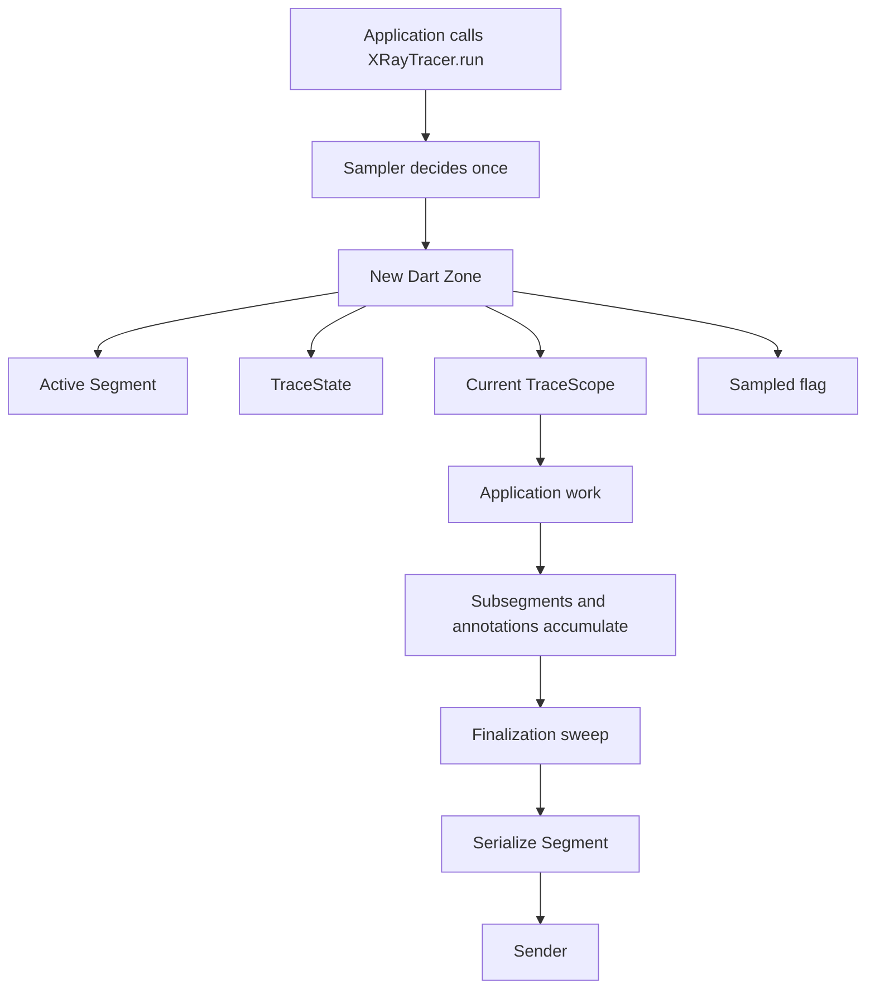
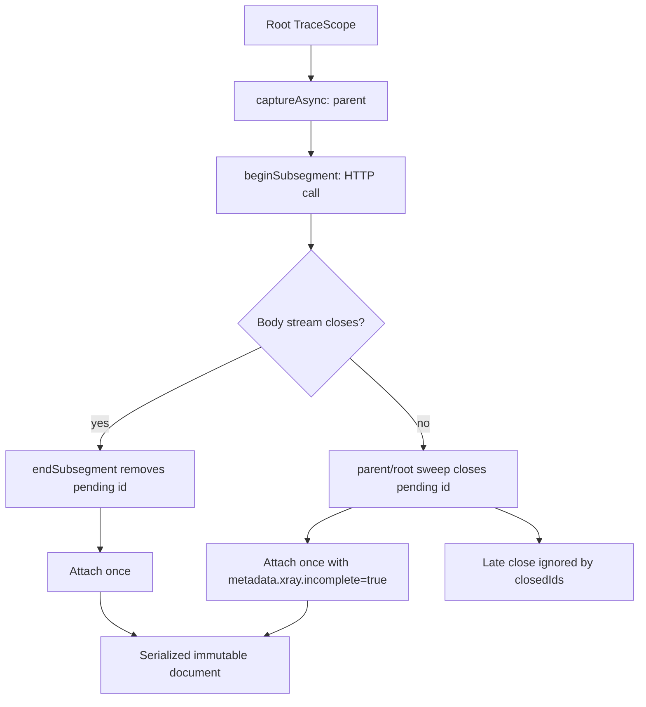
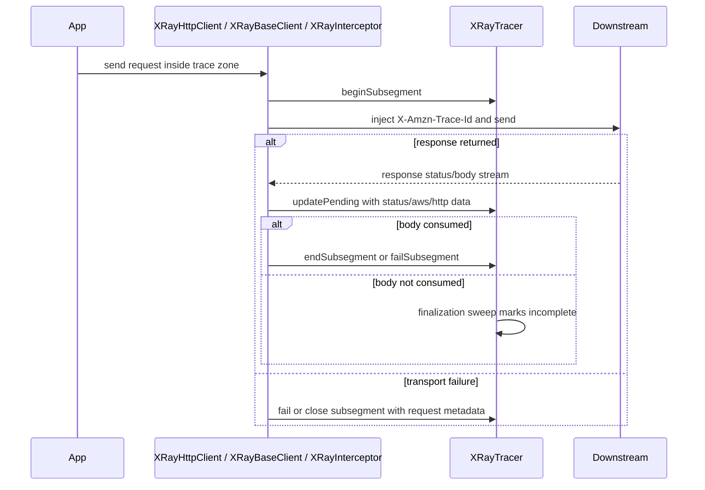
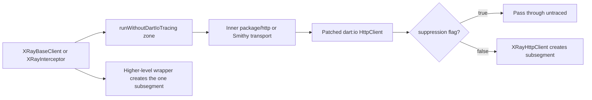
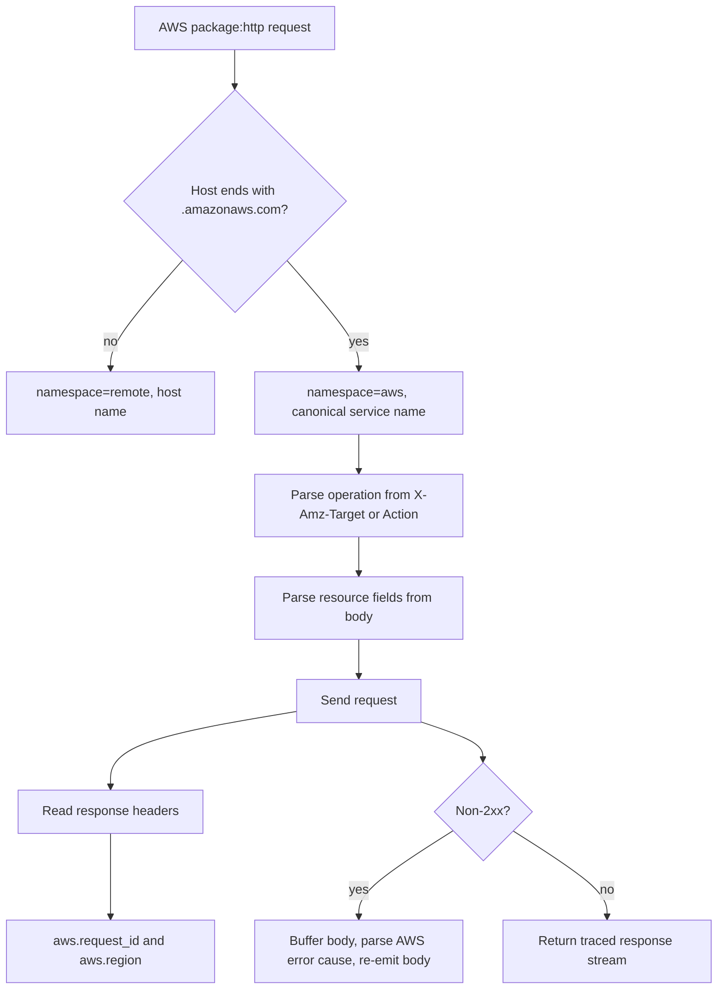
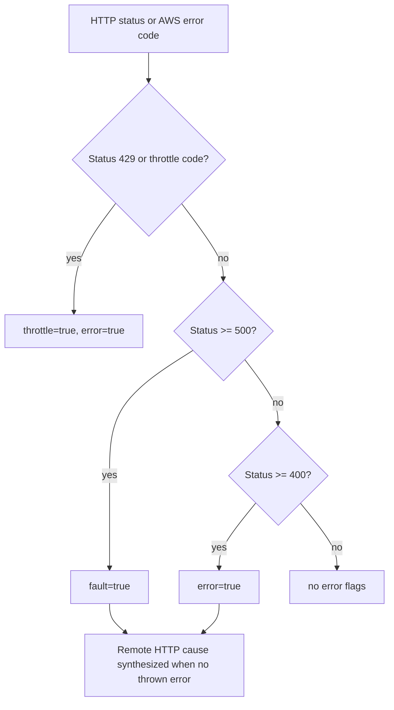
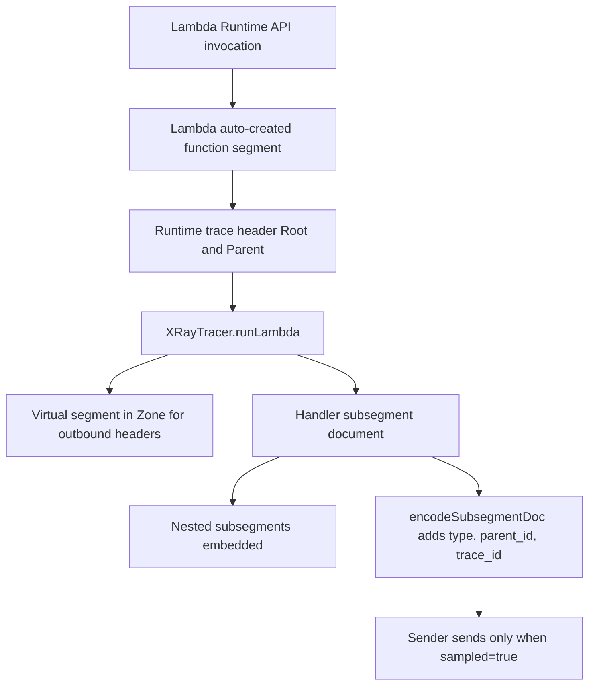

# Tracing Behavior Reference

This document records the SDK's technical tracing contracts. It is intended for
maintainers and users integrating lower-level clients, especially when combining
`dart:io`, `package:http`, Smithy AWS clients, and Lambda custom runtimes.

## Trace Context And Sampling

- `XRayTracer.run(segment, fn)` creates a Dart `Zone` containing:
  - the active `Segment`,
  - one `TraceState` for the trace,
  - the current mutable `TraceScope`,
  - the sampling decision made at entry.
- Sampling is decided once at `run()` entry from the configured
  `SamplingStrategy`. Downstream header injection uses the same decision for the
  whole trace.
- Outside a trace zone, `tracer.currentSegment` returns `null` without side
  effects. Auto-instrumented clients pass through untraced when there is no
  active segment.
- Manual trace-data APIs (`annotate`, `addMetadata`, `endSubsegment`,
  `failSubsegment`) use `ContextMissingPolicy` when data would otherwise be
  dropped:
  - `ignore`: drop silently,
  - `logError`: write a diagnostic to `stderr`,
  - `runtimeError`: throw `StateError`.
- `tracer.isSampled` returns the active zone decision. Outside a trace zone it
  fails open and returns `true`.



## Subsegment Tree Model

- Runtime trace data accumulates in a mutable `TraceScope` tree. Serialized
  `Segment` and `Subsegment` objects remain immutable value objects.
- `captureAsync(name, fn)` creates a child scope in a forked `Zone`. Work and
  auto-instrumented calls inside the callback become children of that subsegment.
- Concurrent `captureAsync` siblings do not share a mutable "current subsegment"
  pointer. Each child scope is zone-confined, so sibling interleaving does not
  corrupt parentage.
- `beginSubsegment(name)` captures the current parent at open time in
  `TraceState.pending`. It can be closed later from a different zone, such as a
  response body stream callback.
- `endSubsegment` and `failSubsegment` are idempotent. The first close wins; a
  second close of the same id is a no-op.
- If a subsegment remains open when its parent scope closes, the finalization
  sweep closes it, attaches it once, and adds
  `metadata.xray.incomplete = true`.
- A late body-stream close after an incomplete sweep is ignored, preventing
  duplicate subsegment ids.



## HTTP Instrumentation

The SDK has three outbound instrumentation paths:

- `XRayHttpClient` for `dart:io` `HttpClient`, usually installed globally with
  `XRay.patchHttp(tracer)`.
- `XRayBaseClient` for `package:http` `BaseClient`.
- `XRayInterceptor` for adapter-registered Smithy clients via
  `XRay.registerClient<T>` and `XRay.fromClient<T>`.

### Common HTTP Fields

When the SDK injects `X-Amzn-Trace-Id`, the emitted subsegment records:

```json
{
  "http": {
    "request": {
      "method": "GET",
      "url": "https://example.com/path",
      "traced": true
    },
    "response": {
      "status": 200,
      "content_length": 123
    }
  }
}
```

- `http.request.traced = true` is asserted on completed response paths after the
  SDK injects `X-Amzn-Trace-Id`.
- `content_length` is recorded when the instrumentation path can observe it.
- Failure paths record request metadata but no response block. Current behavior
  differs by wrapper:
  - `XRayBaseClient` and `XRayInterceptor` set `traced = true` on failures after
    they inject a trace header into the outgoing request.
  - `XRayHttpClient` does not assert `traced = true` on open/close failures; it
    records method and URL only.



### Response Body Lifecycle

- Normal responses close their subsegment after the response body stream is fully
  consumed.
- Body-stream errors mark the subsegment as faulted and preserve request data.
- If the caller never drains the response body, the finalization sweep emits the
  subsegment once with `metadata.xray.incomplete = true` and the status/metadata
  known so far.
- `HttpClientResponse.detachSocket()` explicitly closes the subsegment before
  returning the raw socket.

### No Double Instrumentation

`package:http` and Smithy clients often use `dart:io` under the hood. If
`XRay.patchHttp()` is also active, the same outbound call could otherwise create
two subsegments.

The SDK prevents this with `runWithoutDartIoTracing`:

- `XRayBaseClient` wraps its inner `send` in the suppression zone.
- `XRayInterceptor` wraps its inner send in the suppression zone.
- `XRayHttpClient.openUrl` checks the suppression flag and stands down.

The higher-level wrapper owns the subsegment, so each request is traced exactly
once.



## AWS Metadata

### `package:http` AWS Host Detection

`XRayBaseClient` treats hosts ending in `.amazonaws.com` as AWS calls:

- subsegment namespace: `aws`,
- subsegment name: canonical service name when known (`DynamoDB`, `SNS`, `SQS`,
  `S3`, `KMS`, `Lambda`, etc.), otherwise the endpoint prefix,
- operation parsed from `X-Amz-Target` or query-protocol `Action`,
- resource fields parsed from request body where available:
  - `table_name`,
  - `bucket_name`,
  - `key_id`,
  - `queue_url`,
  - `topic_arn`,
  - `resource_names`,
- `request_id` from `x-amzn-requestid` or `x-amz-request-id`,
- `region` from standard regional hosts such as
  `dynamodb.us-east-1.amazonaws.com`.

For non-2xx AWS responses, `XRayBaseClient` buffers the response body, extracts
AWS JSON/XML error type and message, records a remote `cause`, and re-emits the
same body to the caller.



`XRayBaseClient` mutates the `http.BaseRequest` instance to inject
`X-Amzn-Trace-Id`. Treat request objects as single-use; re-sending the same
instance can reuse the first attempt's `Parent=` id.

### Smithy Client Adapter Contract

`SmithyRequestAdapter` returns:

```dart
({
  String operationName,
  String method,
  String url,
  Map<String, Object?> body,
  Req Function(Req original, String traceHeader) withTraceHeader,
})
```

`SmithyResponseAdapter` returns:

```dart
({
  int statusCode,
  int? contentLength,
  String? requestId,
  String? region,
  String? errorCode,
})
```

- `requestId` is emitted as `aws.request_id`.
- `region` is emitted as `aws.region`; if omitted, the SDK derives the region
  from standard regional AWS hosts when possible.
- `errorCode` is used for AWS throttling detection.
- Missing optional values are omitted from the emitted JSON, never serialized as
  null or empty strings.

`XRay.registerClient(namespace:)` stores only valid X-Ray subsegment namespaces:

- `aws` and `remote` are preserved,
- values starting with `AWS::` normalize to `aws`,
- other custom values normalize to `remote`.

## Error, Fault, And Throttle Semantics

HTTP status mapping:

- `status == 429`: `throttle = true` and `error = true`,
- `status >= 500`: `fault = true`,
- `status >= 400`: `error = true`,
- lower status codes do not set error flags.

When an error status returns normally, the SDK synthesizes a remote cause:

```json
{
  "cause": {
    "exceptions": [
      {
        "type": "HTTP 500",
        "message": "Downstream HTTP response returned status 500",
        "remote": true
      }
    ]
  }
}
```

AWS throttling is detected by HTTP `429` and by known AWS error codes, including:

- `Throttling`,
- `ThrottlingException`,
- `ThrottledException`,
- `RequestThrottledException`,
- `TooManyRequestsException`,
- `TooManyRequests`,
- `ProvisionedThroughputExceededException`,
- `RequestLimitExceeded`,
- `LimitExceededException`,
- `SlowDown`.

Thrown non-throttle exceptions are recorded as faults. Thrown AWS throttle
exceptions are recorded as `throttle = true` and `error = true`, then rethrown to
the caller.



## Lambda Custom Runtime Contract

`XRayTracer.runLambda(traceId, lambdaParentId, name, fn, sampled: sampled)` is
for Lambda custom runtimes where the platform has already created the root
`AWS::Lambda::Function` segment.

- The SDK does not emit a competing top-level segment.
- It emits one independent subsegment document with:
  - `type: subsegment`,
  - `parent_id: lambdaParentId`,
  - `trace_id: traceId`.
- Nested subsegments opened inside the handler are embedded in that document.
- The document is sent only when `sampled` is true.
- Sender errors are contained and never mask the handler result or exception.

Read trace context from the Lambda Runtime API's
`Lambda-Runtime-Trace-Id` response header for each invocation. Do not rely on a
stale process-level `_X_AMZN_TRACE_ID` environment variable.



## Annotation And Metadata Rules

- Annotation keys are sanitized to `[A-Za-z0-9_]` at every entry point.
- Invalid annotation key characters are replaced with `_`; an empty/all-invalid
  key becomes `_`.
- Annotation values must be scalar (`String`, `bool`, `int`, `double`).
  Non-scalar values are coerced with `toString()`.
- Annotation validation never throws and never drops a trace.
- Metadata is not validated by the SDK. It should be JSON-serializable.
- Avoid metadata namespaces beginning with `AWS.`, which X-Ray reserves.

## Transport And Encoding

- `UdpSender` is the default sender.
- UDP payloads use the X-Ray daemon header:
  `{"format":"json","version":1}` followed by a newline and JSON document.
- If a segment document with many subsegments exceeds 64 KB, the encoder emits a
  segment skeleton followed by independent subsegment documents.
- `encodeSubsegmentDoc` injects the required `type`, `parent_id`, and `trace_id`
  fields for independent subsegment documents.
- Sender failures are contained by `XRayTracer.run`, `runLambda`,
  `closeSegment`, and `close`; tracing must not fault application work.
- UDP has no delivery acknowledgment. `UdpSender.onError` reports local
  resolve/bind/send failures only, not daemon receipt.

Known encoding boundary: the current encoder splits large segments with multiple
subsegments, but it does not truncate a single oversized subsegment document.
Keep individual subsegment metadata/cause payloads well below the X-Ray daemon's
64 KB UDP payload limit.

## Supported Runtimes And Scope

- Supported: Dart VM server applications and Lambda custom runtimes.
- Not supported: browser/web runtimes.
- The package is pure Dart and does not use `dart:mirrors`, reflection, or
  `build_runner`.
- The SDK remains client-agnostic. AWS SDK support is adapter-based and does not
  add a runtime dependency on concrete AWS client packages.
